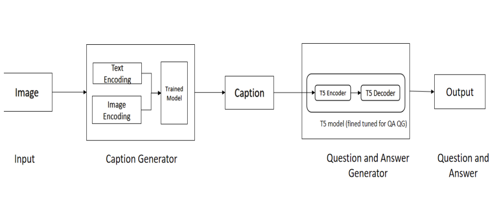

# Document-Visual-Question-Answering

The task of answering questions concerning a specific piece of visual content, such as an image, video, or infographic, is known as visual question answering (VQA). Recognizing entities
and objects, reasoning about their spatial and temporal interactions, reading text, parsing audio, interpreting abstract and graphical illustrations, and using external knowledge not directly present in the given content are just some of the skills required to answer questions
about visual content. VQA has recently been a major topic in the fields of computer vision, natural language understanding, and artificial intelligence.

Answering visual questions necessitates the acquisition of daily common knowledge and the modelling of the semantic relationship between different components of images, which is too
complex for VQA systems to learn from images with only responses as guidance.Meanwhile, to address this problem, we present a system that can produce image captions and answer
visual questions by combining two tasks that compensate for each other. In particular, we leverage image features to generate question-related captions and use the generated captions as
additional features to provide new knowledge to the VQA system when it generates questions and then answers them.

##Workflow of the proposed system

In this system first, we will take an input image,then the image is passed through caption generator in which image encoding and text encoding takes place and captions will be generated from the caption generator, now question and answer will be generated from the questionand-answer generator model which is trained with finetuned t5 encoder and decoder.

