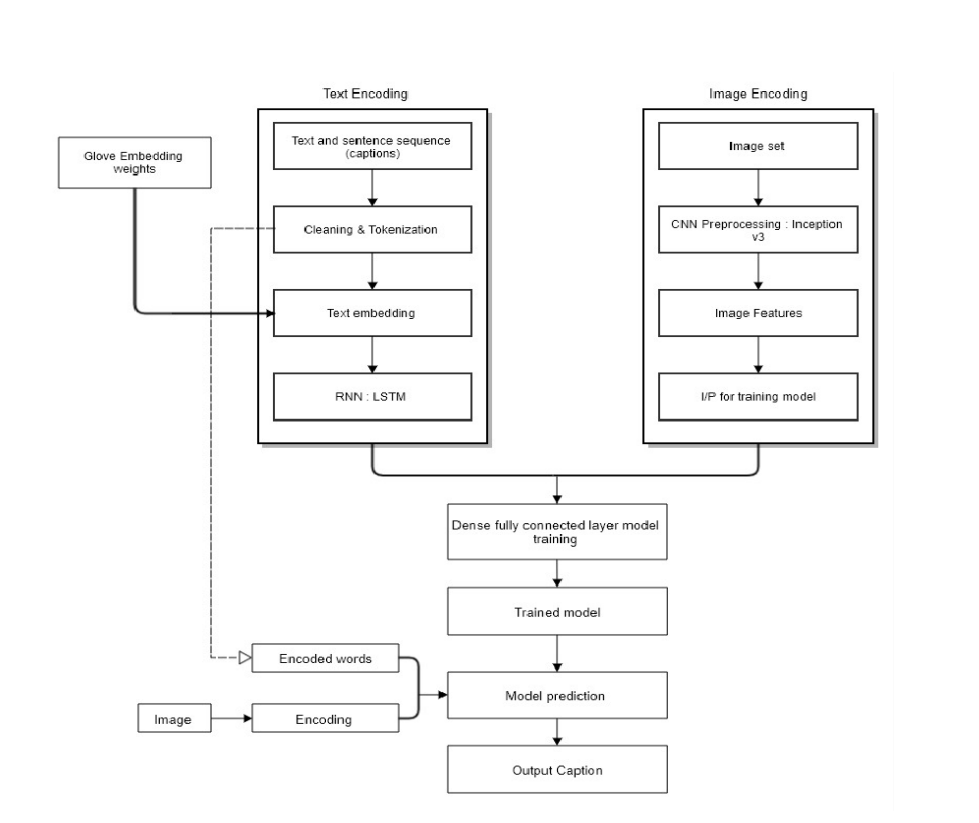
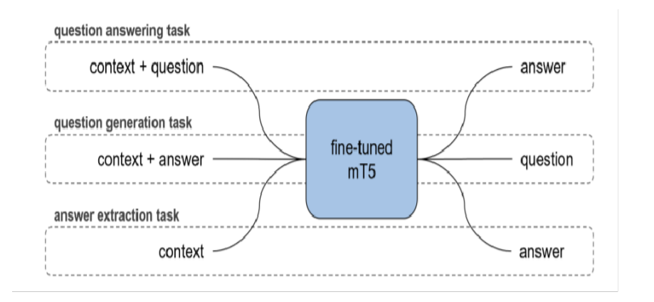

# Document-Visual-Question-Answering

The task of answering questions concerning a specific piece of visual content, such as an image, video, or infographic, is known as visual question answering (VQA). Recognizing entities
and objects, reasoning about their spatial and temporal interactions, reading text, parsing audio, interpreting abstract and graphical illustrations, and using external knowledge not directly present in the given content are just some of the skills required to answer questions
about visual content. VQA has recently been a major topic in the fields of computer vision, natural language understanding, and artificial intelligence.

Answering visual questions necessitates the acquisition of daily common knowledge and the modelling of the semantic relationship between different components of images, which is too
complex for VQA systems to learn from images with only responses as guidance.Meanwhile, to address this problem, we present a system that can produce image captions and answer
visual questions by combining two tasks that compensate for each other. In particular, we leverage image features to generate question-related captions and use the generated captions as
additional features to provide new knowledge to the VQA system when it generates questions and then answers them.

## Workflow of the proposed system.

In this system first, we will take an input image,then the image is passed through caption generator in which image encoding and text encoding takes place and captions will be generated from the caption generator, now question and answer will be generated from the questionand-answer generator model which is trained with finetuned t5 encoder and decoder.

## Framework for image captioning

In this module encoding of the image from CNN is done to get its feature vector.During encoding, the image is passed through various convolutional kernels which extracts the useful information from the images.For text encoding,first the text data was cleaned using NLP techniques and captions are tokenized with respect to images,then the word embedding is carried out using glove embedding model weights for word2vec representation of words to achieve the relation between the words.Then image vectors and embedded words were passed to LSTM for image captioning.The encoded images features and embedded words from LSTM are mapped with fully connected layer to generate the captions for the images. Figure 3.2 gives us the brief about the Framework of the caption generation. 

## Framework for Question and Answer Generation

In this module, firstly the context is given along with the answer. In the next step context+answer is feeded to the fine-tuned mt5 model which generates the question.Further to cross-check whether the generated question is accurate the model is feeded with the context+question which in turn produces the answer. If the answer generated is similar to the answer in the previous step then the generated question and answer is considered to be valid.

